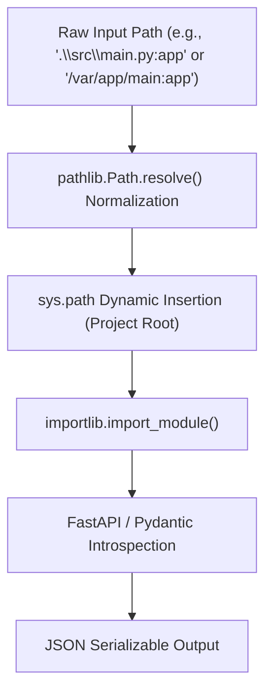

# fastapi-mcp-server: Comprehensive Technical Specification

**Version:** 1.0.0-draft  
**Status:** Approved for Implementation  
**Target Environments:** Windows (pwsh/cmd), macOS (zsh/bash), Linux (bash/sh)  
**Supported Python Versions:** Python >= 3.10  

---

## 1. Executive Summary & Goals

`fastapi-mcp-server` is a standalone **Model Context Protocol (MCP)** server built as a **co-developer tool** for FastAPI and Pydantic engineers. Rather than acting as an API gateway that calls deployed endpoints, it inspects local source code to extract accurate OpenAPI schemas, Pydantic models, and route definitions. This eliminates hallucinated field names, invalid HTTP methods, and wrong endpoint paths in AI-assisted development.

### Core Objectives
1. **Universal Client Support:** Seamlessly connect with any MCP-compliant client via standard I/O (StdIO), including **VS Code** (GitHub Copilot / MCP extension), **Zed**, **Cursor**, **Claude Desktop**, **Windsurf**, and CLI MCP inspectors.
2. **Cross-Platform Portability:** Guarantee identical, rock-solid behavior across Windows, macOS, and Linux by using normalized path representations and POSIX/Windows agnostic resolution.
3. **Robust Isolation & Fault Tolerance:** Prevent MCP server crashes caused by broken developer code, missing dependencies, or syntax errors, returning clear, actionable JSON error envelopes to the AI.
4. **Zero-Configuration Zero-Friction:** Support execution via `uvx fastapi-mcp-server`, `python -m fastapi_mcp_server`, or console script entrypoints.

---

## 2. Cross-Platform Compatibility Architecture

Operating system discrepancies are the primary failure point for local code inspection tools. `fastapi-mcp-server` enforces the following architectural safeguards:



### 2.1. Path & Import String Normalization
- **Path Separation:** Use Python's standard `pathlib.Path` for all file and directory operations. Windows backslashes (`\`) and POSIX forward slashes (`/`) are resolved transparently.
- **Import Notation Support:**
  - Standard dot notation: `"src.api.main:app"`, `"models.user:UserCreate"`
  - File-path hybrid notation: `"src/api/main.py:app"`, `".\\api\\app.py:app"`
  - Bare module names: `"main:app"`
- **Working Directory (`cwd`) Isolation:**
  - MCP servers spawned by IDEs (e.g., VS Code or Zed) may inherit an unpredictable `cwd` (e.g., the user's home directory instead of the workspace root).
  - Every tool accepts an optional `base_path` (or `project_dir`) parameter. If omitted, `Path.cwd()` is resolved. The resolved path is prepended to `sys.path` to guarantee deterministic imports.

### 2.2. Standard I/O (StdIO) Encoding on Windows
- Windows standard streams can default to legacy encodings (like `cp1252`), which breaks JSON-RPC payloads containing Unicode characters.
- FastMCP uses UTF-8 explicitly. The CLI entrypoint ensures `sys.stdin` and `sys.stdout` operate in UTF-8 mode without mangling binary buffers.

---

## 3. Universal MCP Client Compatibility Matrix

| Client | Connection Mode | Command Configuration Example |
| :--- | :--- | :--- |
| **VS Code** (MCP / Copilot) | `stdio` | `{"command": "uvx", "args": ["fastapi-mcp-server"]}` |
| **Zed** | `stdio` | `{"command": "fastapi-mcp-server", "args": []}` |
| **Cursor** | `stdio` | `{"command": "python", "args": ["-m", "fastapi_mcp_server"]}` |
| **Claude Desktop** | `stdio` | `{"command": "uv", "args": ["run", "--with", "fastapi-mcp-server", "fastapi-mcp-server"]}` |
| **Windsurf / Cascade** | `stdio` | `{"command": "fastapi-mcp-server", "args": []}` |

---

## 4. MCP Tools & Interface Specifications

### 4.1. Tool 1: `get_openapi_schema`
- **Description:** Dynamically imports a FastAPI application instance from the local workspace and generates its complete OpenAPI 3.1.0/3.0.x JSON schema.
- **Parameters:**
  - `app_path` (*string, required*): Module and attribute locator (e.g., `"main:app"` or `"src/api.py:app"`).
  - `project_dir` (*string, optional*): Absolute or relative path to the project root directory. Defaults to current working directory.
- **Response Format:**
  ```json
  {
    "openapi": "3.1.0",
    "info": { "title": "FastAPI", "version": "0.1.0" },
    "paths": { ... },
    "components": { ... }
  }
  ```

### 4.2. Tool 2: `get_pydantic_schema`
- **Description:** Dynamically imports a Pydantic `BaseModel` class and returns its JSON Schema definition. Supports both Pydantic v2 (`model_json_schema()`) and Pydantic v1 fallback (`schema()`).
- **Parameters:**
  - `model_path` (*string, required*): Module and class name (e.g., `"models.user:UserCreate"`).
  - `project_dir` (*string, optional*): Project root directory path.
- **Response Format:**
  ```json
  {
    "title": "UserCreate",
    "type": "object",
    "properties": {
      "username": { "title": "Username", "type": "string" },
      "email": { "title": "Email", "type": "string", "format": "email" }
    },
    "required": ["username", "email"]
  }
  ```

### 4.3. Tool 3: `list_registered_routes`
- **Description:** Inspects a FastAPI app's route table and returns a clean, structured list of all registered HTTP endpoints and WebSocket routes.
- **Parameters:**
  - `app_path` (*string, required*): Module and attribute locator (e.g., `"main:app"`).
  - `project_dir` (*string, optional*): Project root directory path.
- **Response Format:**
  ```json
  [
    {
      "path": "/users/{user_id}",
      "name": "get_user",
      "methods": ["GET"],
      "operation_id": "get_user_users__user_id__get",
      "summary": "Retrieve user details by ID",
      "tags": ["Users"],
      "deprecated": false
    }
  ]
  ```

---

## 5. Error Handling & Fault Isolation Matrix

When dynamic importing fails, the server **must not throw unhandled exceptions** that terminate the JSON-RPC pipe. Errors are caught, formatted, and returned as structured diagnostic JSON:

| Failure Scenario | Internal Exception | Client/AI Return Payload |
| :--- | :--- | :--- |
| Invalid target format | `ValueError` | `{"error": "InvalidTargetFormat", "message": "Expected 'module:attribute' format, got 'main'"}` |
| File / Module not found | `ModuleNotFoundError` | `{"error": "ModuleNotFound", "message": "No module named 'main'. Searched in: [...]"}` |
| Attribute is not found | `AttributeError` | `{"error": "AttributeNotFound", "message": "Module 'main' has no attribute 'app'"}` |
| Target is not FastAPI | `TypeError` | `{"error": "InvalidType", "message": "Target 'app' is an instance of 'Flask', expected 'fastapi.FastAPI'"}` |
| Target is not Pydantic | `TypeError` | `{"error": "InvalidType", "message": "Target 'User' is not a subclass of 'pydantic.BaseModel'"}` |
| Runtime error during import | `Exception` | `{"error": "ImportExecutionError", "message": "Failed to execute module 'main': ...", "traceback": "..."}` |

---

## 6. Directory Structure & Packaging Spec

```text
fastapi-mcp-server/
├── pyproject.toml              # Hatchling build config, CLI entrypoints, dependencies
├── README.md                   # Multi-client setup guides (VS Code, Zed, Cursor, Claude)
├── src/
│   └── fastapi_mcp_server/
│       ├── __init__.py         # Version info & public exports
│       ├── __main__.py         # Direct invocation CLI (`python -m fastapi_mcp_server`)
│       ├── server.py           # FastMCP instance & registered @mcp.tool functions
│       └── inspector.py        # Import resolution, schema reflection, & error wrappers
└── tests/
    ├── __init__.py
    ├── sample_app.py           # Sample FastAPI app & Pydantic models for testing
    └── test_server.py          # Pytest suite (inspection, routes, error handling)
```

### Build & Dependency Specifications
- **Build Backend:** `hatchling`
- **Core Dependencies:**
  - `mcp>=1.0.0`
  - `fastapi>=0.100.0`
  - `pydantic>=2.0.0`
- **Zero OS-specific dependencies:** Pure Python standard library + pure Python/cross-platform wheels.

---

## 7. Verification & Test Plan

1. **Unit & Integration Tests (`pytest`):**
   - Test resolving valid/invalid module paths on Windows and POSIX path syntax.
   - Test OpenAPI extraction on nested APIRouters.
   - Test Pydantic v2 schema generation.
   - Test route extraction across `APIRoute`, `Route`, and custom sub-routers.
2. **End-to-End MCP Stdio Test:**
   - Execute CLI via standard input pipe (`echo '{"jsonrpc":"2.0",...}' | fastapi-mcp-server`) to verify non-blocking stdio initialization.
